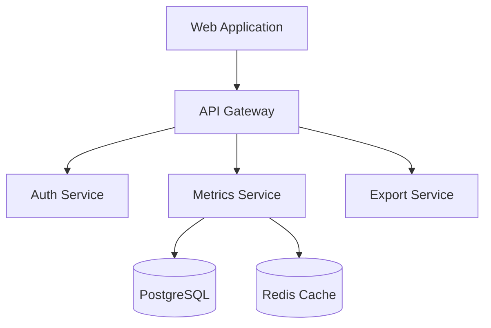
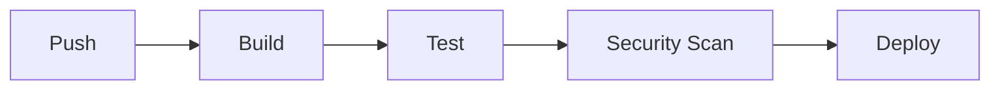
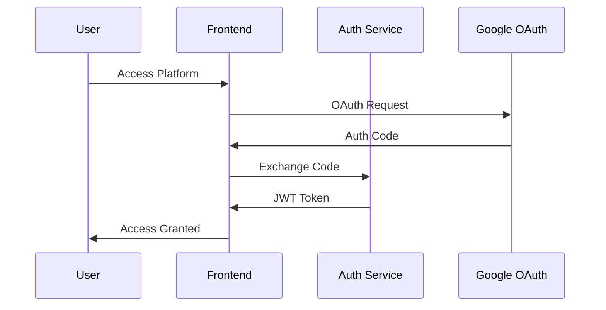

# Startup Metrics Benchmarking Platform

[](https://github.com/org/repo/actions)
[](https://codecov.io/gh/org/repo)
[](https://snyk.io/test/github/org/repo)
[](https://opensource.org/licenses/MIT)
[](https://github.com/org/repo/releases)

Enterprise-grade benchmarking platform providing comprehensive startup metrics analysis and comparison tools.

## Project Overview

The Startup Metrics Benchmarking Platform is a web-based solution enabling founders and executives to access reliable benchmark data across key startup metrics. Built with modern web technologies and enterprise-grade security, the platform delivers:

- Real-time metric comparisons across revenue ranges
- Multi-source benchmark aggregation
- Customizable data visualizations
- Secure company data handling
- Google OAuth integration

### Architecture



### Key Features

- **Authentication & Authorization**
  - Google OAuth 2.0 integration
  - Role-based access control
  - Secure session management

- **Benchmark Analysis**
  - Multi-source data visualization
  - Revenue-based filtering
  - Metric comparisons

- **Company Metrics**
  - Metric input and validation
  - Personalized analysis
  - Export capabilities

- **Administrative Tools**
  - Metric management
  - Source control
  - User administration

## Getting Started

### Prerequisites

- Node.js 18 LTS
- Docker 20+
- PostgreSQL 13+
- Redis 6+

### Development Environment Setup

1. Clone the repository:
```bash
git clone https://github.com/org/startup-metrics-platform.git
cd startup-metrics-platform
```

2. Install dependencies:
```bash
npm install
```

3. Configure environment variables:
```bash
cp .env.example .env
# Edit .env with your configuration
```

4. Start development services:
```bash
docker-compose up -d
```

5. Run database migrations:
```bash
npm run migrate
```

6. Start development server:
```bash
npm run dev
```

### Environment Variables

```plaintext
# Application
NODE_ENV=development
PORT=3000
API_VERSION=v1

# Authentication
GOOGLE_CLIENT_ID=your_client_id
GOOGLE_CLIENT_SECRET=your_client_secret
JWT_SECRET=your_jwt_secret

# Database
POSTGRES_HOST=localhost
POSTGRES_PORT=5432
POSTGRES_DB=metrics_platform
POSTGRES_USER=postgres
POSTGRES_PASSWORD=password

# Redis
REDIS_HOST=localhost
REDIS_PORT=6379
```

## Project Structure

```plaintext
.
├── src/
│   ├── api/           # API endpoints
│   ├── auth/          # Authentication services
│   ├── metrics/       # Metrics processing
│   ├── models/        # Database models
│   └── utils/         # Shared utilities
├── infrastructure/    # Infrastructure as code
│   ├── terraform/     # AWS infrastructure
│   └── kubernetes/    # K8s configurations
├── tests/            # Test suites
└── docs/             # Documentation
```

## Development

### Code Standards

- TypeScript for type safety
- ESLint for code linting
- Prettier for code formatting
- Jest for testing
- Conventional Commits

### Testing Requirements

```bash
# Run unit tests
npm run test

# Run integration tests
npm run test:integration

# Run e2e tests
npm run test:e2e

# Generate coverage report
npm run test:coverage
```

## Infrastructure

### AWS Architecture

- ECS Fargate for container orchestration
- RDS PostgreSQL for database
- ElastiCache Redis for caching
- S3 for static assets and backups
- CloudFront for CDN
- WAF for security

### Container Orchestration

```bash
# Build containers
docker-compose build

# Start services
docker-compose up -d

# View logs
docker-compose logs -f
```

## Deployment

### Environments

- Development: Feature testing
- Staging: Pre-production validation
- Production: Live environment

### CI/CD Pipeline



## Security

### Authentication Flow



### Security Features

- TLS 1.3 encryption
- JWT token authentication
- Role-based access control
- Data encryption at rest
- WAF protection
- Regular security audits

## Operations

### Monitoring

- Prometheus for metrics
- ELK Stack for logs
- Grafana for visualization
- PagerDuty for alerts

### Backup Procedures

- Automated daily backups
- Point-in-time recovery
- Cross-region replication
- 30-day retention

## Support

For support and questions:
- Create an issue
- Contact support@platform.com
- Join our Slack community

## License

This project is licensed under the MIT License - see the [LICENSE](LICENSE) file for details.

## Contributing

Please read [CONTRIBUTING.md](CONTRIBUTING.md) for details on our code of conduct and the process for submitting pull requests.