# Product Requirements Document (PRD)

# 1. INTRODUCTION

## 1.1 Purpose

This Product Requirements Document (PRD) serves as the authoritative specification for a web-based startup metrics benchmarking platform. It is intended for:

- Development teams implementing the technical solution
- Product managers overseeing feature development
- UX/UI designers creating the interface
- QA teams validating functionality
- Stakeholders evaluating project scope and progress

## 1.2 Scope

The platform enables startup founders and executives to:

- Access comprehensive benchmark data across key startup metrics
- Compare their company's performance against industry standards
- Visualize data from multiple authoritative sources
- Filter and analyze metrics by revenue range
- Generate personalized benchmark comparisons
- Export customized reports

Core functionalities include:

- Google OAuth-based user authentication
- Interactive metric comparison tools
- Multi-source benchmark data management
- Administrative controls for metric and data handling
- Customizable data visualization system
- Revenue-based filtering capabilities
- Brand-aligned interface design
- Secure data storage and handling

The platform specifically focuses on SaaS industry metrics across financial, growth, and operational categories, providing percentile-based comparisons within defined revenue ranges from under $1M to over $50M ARR.

# 2. PRODUCT DESCRIPTION

## 2.1 Product Perspective

The startup metrics benchmarking platform operates as a standalone web application that integrates with Google OAuth for authentication. It exists within the broader ecosystem of startup analytics and business intelligence tools, uniquely positioned to provide comprehensive benchmark comparisons across multiple authoritative data sources.

Key integration points include:
- Google OAuth 2.0 for user authentication and access control
- Cloud-based hosting infrastructure for scalability
- RESTful APIs for potential future integrations
- Modern web browsers as the primary client interface
- Secure database systems for storing benchmark and user data

## 2.2 Product Functions

The platform provides these core functions:

1. Benchmark Data Access
   - Browse comprehensive metric libraries
   - View percentile-based comparisons
   - Filter by revenue ranges
   - Compare across multiple data sources

2. Personalized Analysis
   - Input company-specific metrics
   - Generate comparative visualizations
   - Save and track metrics over time
   - Export customized reports

3. Administrative Control
   - Manage metric definitions and categories
   - Control data source integrations
   - Monitor user activity
   - Maintain data quality

4. Data Visualization
   - Interactive bar charts
   - Multi-source comparisons
   - Percentile distributions
   - Trend analysis

## 2.3 User Characteristics

### Primary Users: Startup Founders and Executives
- Technical proficiency: Moderate to high
- Data literacy: High
- Time availability: Limited
- Primary goals: Quick insights and competitive positioning
- Usage pattern: Regular but brief sessions

### Secondary Users: Financial Analysts and Operations Teams
- Technical proficiency: High
- Data literacy: Very high
- Time availability: Moderate
- Primary goals: Detailed analysis and reporting
- Usage pattern: Extended analytical sessions

### Administrative Users
- Technical proficiency: Very high
- Data literacy: High
- System knowledge: Expert level
- Primary goals: Platform maintenance and data quality
- Usage pattern: Periodic maintenance sessions

## 2.4 Constraints

1. Technical Constraints
   - Must be compatible with Replit development environment
   - Limited to web browser-based interface
   - Must support major browser versions from last 2 years
   - Response time under 2 seconds for standard operations

2. Regulatory Constraints
   - GDPR compliance required
   - CCPA compliance required
   - Data privacy regulations for user metrics
   - Secure storage requirements for sensitive data

3. Business Constraints
   - Must maintain consistent branding
   - Integration limited to approved data sources
   - Authentication restricted to Google OAuth
   - Regular security audit requirements

## 2.5 Assumptions and Dependencies

### Assumptions
1. Users have stable internet connectivity
2. Users access platform via modern web browsers
3. Benchmark data sources maintain consistent data formats
4. Users have Google accounts for authentication
5. Source data updates occur at predictable intervals

### Dependencies
1. External Services
   - Google OAuth service availability
   - Cloud hosting platform reliability
   - Third-party benchmark data source accessibility
   - Data visualization library support

2. Technical Dependencies
   - Modern browser capabilities
   - Database system performance
   - Network infrastructure reliability
   - Security certificate maintenance

3. Business Dependencies
   - Continued access to benchmark data sources
   - Maintenance of data sharing agreements
   - Regular updates to industry benchmarks
   - Ongoing technical support resources

# 3. PROCESS FLOWCHART


# 4. FUNCTIONAL REQUIREMENTS

## 4.1 Authentication and User Management

### ID: F-001
### Description
Google OAuth-based authentication system with user profile management
### Priority: High
### Requirements

| ID | Requirement | Acceptance Criteria |
|---|---|---|
| F-001.1 | Implement Google OAuth 2.0 login | - Successful redirect to Google login<br>- Proper handling of OAuth tokens<br>- Secure session management |
| F-001.2 | User profile creation | - Automatic profile creation after first login<br>- Storage of basic user information<br>- Profile editing capabilities |
| F-001.3 | Session management | - Token-based authentication<br>- Auto-logout after inactivity<br>- Secure session storage |
| F-001.4 | Access control | - Role-based permissions system<br>- Admin vs regular user distinction<br>- Feature access based on user role |

## 4.2 Benchmark Data Display

### ID: F-002
### Description
Interactive visualization of benchmark data across different metrics and revenue ranges
### Priority: High
### Requirements

| ID | Requirement | Acceptance Criteria |
|---|---|---|
| F-002.1 | Revenue range filtering | - Accurate filtering by 5 revenue ranges<br>- Clear visual indication of selected range<br>- Proper data refresh on range change |
| F-002.2 | Metric visualization | - Bar chart display of percentile data<br>- Proper formatting based on metric type<br>- Interactive tooltips with detailed information |
| F-002.3 | Multi-source comparison | - Side-by-side display of different sources<br>- Clear source attribution<br>- Visual distinction between sources |
| F-002.4 | Data navigation | - Category-based metric organization<br>- Smooth transitions between metrics<br>- Breadcrumb navigation |

## 4.3 Company Comparison Tool

### ID: F-003
### Description
Tool for comparing company metrics against benchmark data
### Priority: High
### Requirements

| ID | Requirement | Acceptance Criteria |
|---|---|---|
| F-003.1 | Metric input | - Format validation by metric type<br>- Auto-formatting of values<br>- Error handling for invalid inputs |
| F-003.2 | Comparison visualization | - Clear visual comparison with benchmarks<br>- Percentile ranking indication<br>- Performance indicators |
| F-003.3 | Data persistence | - Optional saving of company metrics<br>- Secure storage of sensitive data<br>- Data deletion capability |
| F-003.4 | Export functionality | - PDF/CSV export options<br>- Customizable report generation<br>- Proper formatting of exported data |

## 4.4 Administrative Controls

### ID: F-004
### Description
Comprehensive admin interface for platform management
### Priority: Medium
### Requirements

| ID | Requirement | Acceptance Criteria |
|---|---|---|
| F-004.1 | Metric management | - Create/edit/delete metrics<br>- Category management<br>- Metric validation rules |
| F-004.2 | Data source control | - Source addition and removal<br>- URL management<br>- Source attribution handling |
| F-004.3 | User management | - User activity monitoring<br>- Account management<br>- Access control administration |
| F-004.4 | Audit logging | - Comprehensive action logging<br>- Audit trail access<br>- Log filtering and export |

## 4.5 Data Visualization System

### ID: F-005
### Description
Interactive and responsive charting system for benchmark data
### Priority: High
### Requirements

| ID | Requirement | Acceptance Criteria |
|---|---|---|
| F-005.1 | Chart rendering | - Responsive design across devices<br>- Brand color implementation<br>- Smooth animations |
| F-005.2 | Interactivity | - Tooltip functionality<br>- Click/hover interactions<br>- Dynamic data updates |
| F-005.3 | Chart types | - Bar chart implementation<br>- Percentile visualization<br>- Trend indicators |
| F-005.4 | Performance | - Optimized rendering<br>- Efficient data handling<br>- Smooth transitions |

## 4.6 Data Management

### ID: F-006
### Description
Backend system for handling benchmark and user data
### Priority: Medium
### Requirements

| ID | Requirement | Acceptance Criteria |
|---|---|---|
| F-006.1 | Data storage | - Secure database implementation<br>- Data encryption<br>- Backup systems |
| F-006.2 | Data validation | - Input validation rules<br>- Data integrity checks<br>- Error handling |
| F-006.3 | Data import | - Source data integration<br>- Format validation<br>- Import error handling |
| F-006.4 | Data export | - Multiple format support<br>- Proper formatting<br>- Export error handling |

# 5. NON-FUNCTIONAL REQUIREMENTS

## 5.1 Performance Requirements

| Requirement | Description | Target Metric |
|------------|-------------|---------------|
| Response Time | Maximum time for page load and data retrieval | < 2 seconds for 95% of requests |
| API Response | Maximum time for API endpoint responses | < 500ms for 99% of requests |
| Chart Rendering | Time to render interactive visualizations | < 1 second for complex charts |
| Concurrent Users | Number of simultaneous users supported | 500 concurrent users minimum |
| Database Queries | Maximum query execution time | < 200ms for 95% of queries |
| Export Generation | Time to generate and download reports | < 5 seconds for standard reports |

## 5.2 Safety Requirements

| Requirement | Description | Implementation |
|------------|-------------|----------------|
| Data Backup | Regular backup of all system data | Daily incremental, weekly full backups |
| Failure Recovery | System recovery procedures | Automatic failover within 5 minutes |
| Data Validation | Input validation for all user data | Pre-processing validation checks |
| Error Handling | Graceful handling of system errors | User-friendly error messages |
| State Management | Preservation of user session state | Automatic session recovery |
| Data Integrity | Prevention of data corruption | Transaction management, data checksums |

## 5.3 Security Requirements

| Requirement | Description | Implementation |
|------------|-------------|----------------|
| Authentication | User identity verification | Google OAuth 2.0 integration |
| Authorization | Role-based access control | Admin and user role separation |
| Data Encryption | Protection of sensitive data | AES-256 encryption at rest |
| Transport Security | Secure data transmission | TLS 1.3 for all connections |
| Session Management | Secure session handling | JWT with 1-hour expiration |
| Audit Logging | Security event tracking | Comprehensive audit trail |

## 5.4 Quality Requirements

### 5.4.1 Availability
- System uptime: 99.9% excluding planned maintenance
- Maximum planned downtime: 4 hours per month
- Unplanned downtime resolution: < 2 hours

### 5.4.2 Maintainability
- Modular architecture for easy updates
- Comprehensive API documentation
- Automated deployment processes
- Version control with Git
- Automated testing coverage > 80%

### 5.4.3 Usability
- Mobile-responsive design
- WCAG 2.1 Level AA compliance
- Maximum 3 clicks to reach any feature
- Consistent navigation patterns
- Clear error messages and user feedback

### 5.4.4 Scalability
- Horizontal scaling capability
- Auto-scaling based on load
- Database partitioning support
- Caching system implementation
- Load balancing across multiple servers

### 5.4.5 Reliability
- Mean Time Between Failures (MTBF): > 720 hours
- Mean Time To Recovery (MTTR): < 30 minutes
- Error rate: < 0.1% of all requests
- Data consistency checks
- Automated monitoring and alerts

## 5.5 Compliance Requirements

| Requirement | Description | Implementation |
|------------|-------------|----------------|
| GDPR | European data protection compliance | - Data minimization<br>- User consent management<br>- Right to be forgotten<br>- Data portability |
| CCPA | California privacy requirements | - Privacy policy<br>- Data collection disclosure<br>- Opt-out mechanisms |
| SOC 2 | Security and availability standards | - Access controls<br>- Monitoring procedures<br>- Risk assessment |
| WCAG | Web accessibility guidelines | - Screen reader compatibility<br>- Keyboard navigation<br>- Color contrast compliance |
| ISO 27001 | Information security standards | - Security controls<br>- Risk management<br>- Incident response |

## 5.6 Browser Compatibility

| Browser | Minimum Version |
|---------|----------------|
| Chrome | Last 2 major versions |
| Firefox | Last 2 major versions |
| Safari | Last 2 major versions |
| Edge | Last 2 major versions |

## 5.7 Resource Requirements

| Resource | Minimum Specification |
|----------|---------------------|
| Server CPU | 4 cores per instance |
| Server Memory | 8GB RAM per instance |
| Database Storage | 500GB SSD storage |
| Network Bandwidth | 100 Mbps dedicated |
| Cache Memory | 4GB Redis instance |

# 6. DATA REQUIREMENTS

## 6.1 Data Models

### 6.1.1 Core Entities Relationship Diagram


### 6.1.2 Audit and Logging Model

```mermaid
erDiagram
    User ||--o{ AuditLog : "generates"
    AuditLog {
        int id
        int userId
        string action
        string entityType
        int entityId
        json changes
        datetime timestamp
        string ipAddress
    }
    
    User ||--o{ UserSession : "has"
    UserSession {
        int id
        int userId
        string token
        datetime expiresAt
        string deviceInfo
        string ipAddress
    }
```



## 6.2 Data Storage

### 6.2.1 Primary Storage
- PostgreSQL database for structured data
- Separate schemas for:
  - Core application data
  - User metrics and profiles
  - Audit logs
  - Benchmark data

### 6.2.2 Data Retention
| Data Type | Retention Period | Storage Type |
|-----------|-----------------|--------------|
| User Profiles | Indefinite | Primary DB |
| Company Metrics | 5 years | Primary DB |
| Benchmark Data | 3 years | Primary DB |
| Audit Logs | 2 years | Archive Storage |
| Session Data | 30 days | Redis Cache |

### 6.2.3 Backup Strategy
- Daily incremental backups
- Weekly full backups
- 30-day backup retention
- Geographic replication across regions
- Point-in-time recovery capability
- Automated backup verification

### 6.2.4 Recovery Procedures
- Automated failover for high availability
- Recovery Time Objective (RTO): 1 hour
- Recovery Point Objective (RPO): 5 minutes
- Documented disaster recovery procedures
- Regular recovery testing schedule

## 6.3 Data Processing

### 6.3.1 Data Flow Diagram


### 6.3.2 Data Security
- AES-256 encryption for data at rest
- TLS 1.3 for data in transit
- Column-level encryption for sensitive metrics
- Key rotation every 90 days
- Access logging for all data operations
- Role-based access control (RBAC)

### 6.3.3 Data Processing Rules
| Operation | Processing Rule | Validation |
|-----------|----------------|------------|
| Metric Input | Format validation by type | Numeric range checks |
| Benchmark Import | Source data normalization | Schema compliance |
| User Data | PII anonymization | GDPR compliance |
| Export | Data aggregation | Permission verification |
| Analytics | Real-time processing | Cache invalidation |

### 6.3.4 Data Quality Controls
- Automated data validation on input
- Duplicate detection systems
- Data consistency checks
- Regular data quality audits
- Automated anomaly detection
- Data completeness verification

# 7. EXTERNAL INTERFACES

## 7.1 User Interfaces

### 7.1.1 Web Application Interface

| Component | Description | Requirements |
|-----------|-------------|--------------|
| Navigation | Left-side expandable menu | - Responsive design<br>- Smooth animations<br>- Persistent state<br>- Brand color scheme (#151e2d, #46608C, #168947, #DBEAAC, #0D3330) |
| Header | Top banner with branding | - Company logo placement<br>- User profile menu<br>- Notification area<br>- Search functionality |
| Main Content Area | Dynamic content display | - Responsive grid layout<br>- Consistent padding/margins<br>- Mobile-first design<br>- Minimum 1024px width support |
| Charts/Visualizations | Interactive data displays | - Bar chart components<br>- Tooltips<br>- Zoom controls<br>- Export options |

### 7.1.2 Responsive Breakpoints

| Device Type | Width Range | Layout Adjustments |
|-------------|-------------|-------------------|
| Desktop | > 1200px | Full feature set, multi-column layout |
| Tablet | 768px - 1199px | Collapsed navigation, simplified charts |
| Mobile | < 767px | Single column, stacked components |

### 7.1.3 Input Controls

| Control Type | Validation | Format |
|-------------|------------|---------|
| Metric Input Fields | - Type-specific validation<br>- Range checks | - Currency: $XXX,XXX<br>- Percentage: XX.XX%<br>- Number: X,XXX |
| Dropdown Menus | - Required selections<br>- Default values | - Searchable options<br>- Group categorization |
| Date Selectors | - Valid date ranges<br>- Future date restrictions | - MM/DD/YYYY format<br>- Calendar picker |

## 7.2 Software Interfaces

### 7.2.1 Authentication Interface

| Interface | Specification | Protocol |
|-----------|--------------|----------|
| Google OAuth 2.0 | - Client ID/Secret management<br>- Token handling<br>- Refresh mechanisms | HTTPS/REST |
| Session Management | - JWT implementation<br>- Token expiration<br>- Refresh logic | Stateless HTTP |

### 7.2.2 Database Interface

| Component | Implementation | Requirements |
|-----------|----------------|--------------|
| PostgreSQL | - Connection pooling<br>- Query optimization<br>- Backup integration | - Version 13+<br>- SSL encryption<br>- WAL archiving |
| Redis Cache | - Session storage<br>- Query caching<br>- Rate limiting | - Version 6+<br>- Persistence config<br>- Cluster support |

### 7.2.3 External APIs

| Service | Purpose | Protocol |
|---------|----------|----------|
| Export Service | PDF/CSV generation | REST/HTTPS |
| Email Service | User notifications | SMTP/API |
| Monitoring Service | System health checks | REST/WebSocket |

## 7.3 Communication Interfaces

### 7.3.1 Network Protocols

| Protocol | Usage | Requirements |
|----------|--------|--------------|
| HTTPS | All web traffic | - TLS 1.3<br>- Certificate management<br>- HSTS implementation |
| WebSocket | Real-time updates | - Secure WebSocket (wss://)<br>- Heartbeat mechanism<br>- Auto-reconnect |

### 7.3.2 Data Formats

| Format | Usage | Specification |
|--------|-------|---------------|
| JSON | API responses | - RFC 8259 compliant<br>- Compression enabled<br>- UTF-8 encoding |
| CSV | Data exports | - RFC 4180 compliant<br>- UTF-8 with BOM<br>- Proper escaping |
| PDF | Report generation | - PDF/A-1b compliant<br>- Vector graphics<br>- Embedded fonts |

### 7.3.3 API Specifications

```yaml
openapi: 3.0.0
paths:
  /api/v1/metrics:
    get:
      security:
        - bearerAuth: []
      parameters:
        - name: category
          in: query
          required: false
          schema:
            type: string
      responses:
        '200':
          description: Success
          content:
            application/json:
              schema:
                type: array
                items:
                  $ref: '#/components/schemas/Metric'
```

### 7.3.4 Integration Points

| System | Integration Type | Data Flow |
|--------|-----------------|-----------|
| Google OAuth | OAuth 2.0 | Bidirectional |
| Database | Direct Connection | Bidirectional |
| Cache | Internal Service | Bidirectional |
| Export Service | REST API | Unidirectional |
| Monitoring | Agent/API | Unidirectional |

# APPENDICES

## A. GLOSSARY

| Term | Definition |
|------|------------|
| Annual Recurring Revenue (ARR) | The yearly value of subscription-based revenue normalized to a 12-month period |
| Customer Acquisition Cost (CAC) | Total cost associated with acquiring a new customer, including marketing and sales expenses |
| Net Dollar Retention (NDR) | Percentage of recurring revenue retained from existing customers, including expansions and contractions |
| Magic Number | Efficiency metric calculated as net new ARR divided by sales and marketing spend |
| Pipeline Coverage | Ratio of total pipeline opportunities to revenue target |
| Gross Margins | Percentage of revenue remaining after direct costs of delivering the service |
| CAC Payback Period | Time required to recover the cost of acquiring a customer through their recurring revenue |
| Logo Retention | Percentage of customers retained over a specific period, regardless of revenue value |

## B. ACRONYMS

| Acronym | Expansion |
|---------|-----------|
| API | Application Programming Interface |
| ARR | Annual Recurring Revenue |
| ACV | Annual Contract Value |
| CAC | Customer Acquisition Cost |
| CCPA | California Consumer Privacy Act |
| CI/CD | Continuous Integration/Continuous Deployment |
| GDPR | General Data Protection Regulation |
| G&A | General and Administrative |
| HSTS | HTTP Strict Transport Security |
| JWT | JSON Web Token |
| NDR | Net Dollar Retention |
| NTM | Next Twelve Months |
| PII | Personally Identifiable Information |
| RBAC | Role-Based Access Control |
| R&D | Research and Development |
| S&M | Sales and Marketing |
| SSL | Secure Sockets Layer |
| TLS | Transport Layer Security |
| WAL | Write-Ahead Logging |
| WCAG | Web Content Accessibility Guidelines |

## C. ADDITIONAL REFERENCES

### Technical Standards
1. OAuth 2.0 Specification (RFC 6749)
   - https://tools.ietf.org/html/rfc6749
   
2. JSON Data Interchange Format (RFC 8259)
   - https://tools.ietf.org/html/rfc8259

3. CSV File Format (RFC 4180)
   - https://tools.ietf.org/html/rfc4180

### Development Resources
1. Google OAuth 2.0 Documentation
   - https://developers.google.com/identity/protocols/oauth2

2. PostgreSQL Documentation
   - https://www.postgresql.org/docs/

3. Redis Documentation
   - https://redis.io/documentation

### Security Guidelines
1. OWASP Security Guidelines
   - https://owasp.org/www-project-web-security-testing-guide/

2. GDPR Compliance Checklist
   - https://gdpr.eu/checklist/

3. CCPA Compliance Guide
   - https://oag.ca.gov/privacy/ccpa

### Accessibility Standards
1. WCAG 2.1 Guidelines
   - https://www.w3.org/WAI/WCAG21/quickref/

## D. REVISION HISTORY

| Version | Date | Description | Author |
|---------|------|-------------|---------|
| 1.0 | Initial Release | Complete PRD documentation | Product Team |
| 1.1 | Update | Added detailed data models and API specifications | Technical Team |
| 1.2 | Update | Enhanced security requirements and compliance sections | Security Team |
| 1.3 | Update | Added comprehensive appendices | Documentation Team |