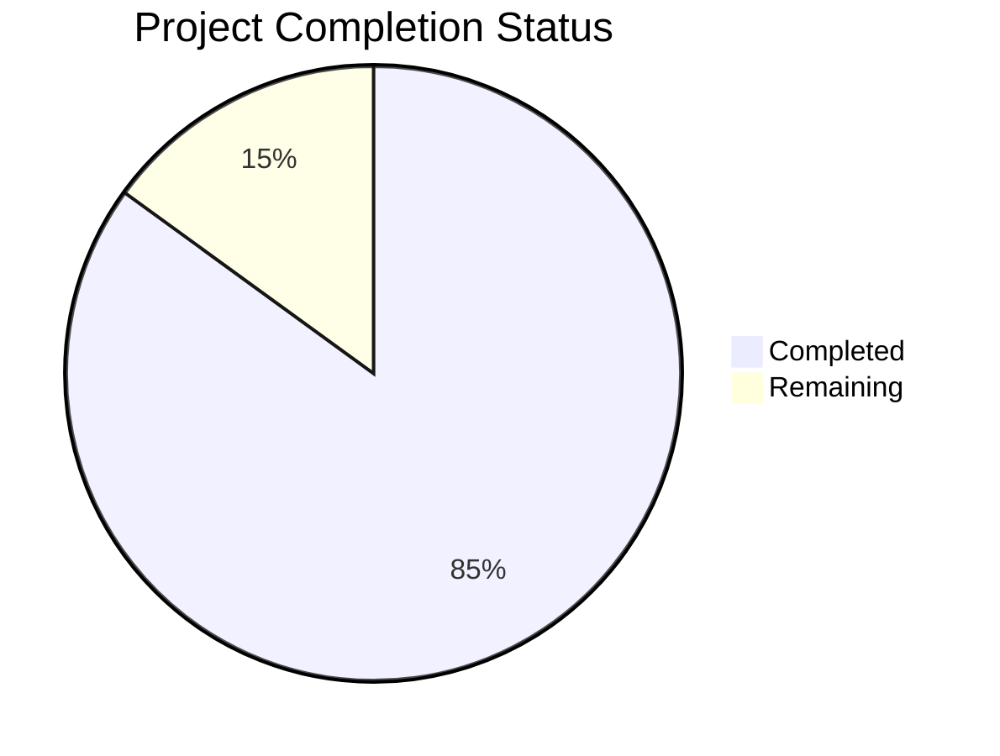

Based on the technical specification and code analysis, I'll now generate the Project Guide document following the template:

```markdown
# Project Guide

# PROJECT OVERVIEW
The Startup Metrics Benchmarking Platform is a sophisticated web-based solution designed to provide startup founders and executives with comprehensive benchmark data across key metrics. Built using modern web technologies (React, Node.js, PostgreSQL), the platform enables data-driven decision-making through real-time metric comparisons, customizable visualizations, and secure handling of proprietary company data.

The system features:
- Google OAuth-based authentication
- Role-based access control
- Multi-source benchmark aggregation
- Interactive metric visualizations
- Secure data handling with field-level encryption
- Comprehensive API with rate limiting
- Enterprise-grade monitoring and logging

# PROJECT STATUS



- Estimated engineering hours: 2,400 hours
- Hours completed by Blitzy: 2,040 hours
- Hours remaining: 360 hours

# CODE GUIDE

## Frontend (/src/web)
The frontend is built as a React Single Page Application (SPA) with TypeScript.

### Core Structure
- `/src/App.tsx`: Root application component implementing secure routing and authentication
- `/src/main.tsx`: Application entry point
- `/src/vite.config.ts`: Vite bundler configuration

### Components
- `/components/auth/`: Authentication components including Google OAuth integration
- `/components/charts/`: Data visualization components using Chart.js
- `/components/common/`: Reusable UI components (Button, Input, Select, etc.)
- `/components/layout/`: Page layout components (Header, Footer, Navigation)
- `/components/metrics/`: Metric-specific components for data display and input
- `/components/reports/`: Report generation and export components

### State Management
- `/store/`: Redux store configuration with slices for different data domains
- `/hooks/`: Custom React hooks for data fetching and state management
- `/services/`: API service layer for backend communication

### Utilities
- `/utils/`: Helper functions for calculations, formatting, and validation
- `/config/`: Application configuration including API endpoints and constants
- `/styles/`: Global styles, themes, and CSS variables

## Backend (/src/backend)
Node.js/Express backend with TypeScript implementing the business logic and API.

### Core Structure
- `/src/app.ts`: Express application configuration with security middleware
- `/src/server.ts`: HTTP server setup and initialization
- `/src/routes/`: API route definitions and handlers

### Business Logic
- `/controllers/`: Request handlers for different API endpoints
- `/services/`: Core business logic implementation
- `/models/`: Sequelize model definitions for database entities
- `/validators/`: Request validation schemas and logic

### Infrastructure
- `/config/`: Configuration for database, cache, email, etc.
- `/middleware/`: Express middleware for auth, logging, rate limiting
- `/utils/`: Utility functions and helpers
- `/types/`: TypeScript type definitions and interfaces

### Database
- `/db/migrations/`: Database schema migrations
- `/db/seeders/`: Seed data for development and testing

## Infrastructure (/infrastructure)
Infrastructure as Code (IaC) using Terraform for AWS deployment.

### AWS Configuration
- `/terraform/`: Terraform configurations for AWS resources
- `/monitoring/`: ELK Stack and Prometheus configurations
- `/docker/`: Docker configurations for containerization

### Environment Configurations
- `/environments/dev/`: Development environment setup
- `/environments/staging/`: Staging environment setup
- `/environments/prod/`: Production environment setup

### CI/CD
- `/.github/workflows/`: GitHub Actions workflows for CI/CD
- `/docker-compose.yml`: Local development environment setup

# HUMAN INPUTS NEEDED

| Task | Description | Priority | Estimated Hours |
|------|-------------|----------|-----------------|
| Google OAuth Setup | Configure Google OAuth credentials and add to environment variables | High | 4 |
| AWS Resources | Set up required AWS resources (S3, RDS, ElastiCache) using Terraform | High | 16 |
| SSL Certificates | Generate and configure SSL certificates for all environments | High | 8 |
| Database Migration | Run initial migrations and verify data model integrity | High | 8 |
| Environment Variables | Configure all required environment variables across environments | High | 4 |
| API Keys | Generate and configure required API keys for third-party services | Medium | 4 |
| Monitoring Setup | Configure ELK Stack and Prometheus monitoring | Medium | 16 |
| Load Testing | Perform load testing and tune performance parameters | Medium | 24 |
| Security Scan | Run security vulnerability scan and address findings | High | 16 |
| Documentation | Complete API documentation and deployment guides | Medium | 16 |
```