# Technical Specifications

# 1. INTRODUCTION

## 1.1 EXECUTIVE SUMMARY

The Startup Metrics Benchmarking Platform is a web-based solution designed to provide founders and executives with comprehensive benchmark data across key startup metrics. By aggregating data from multiple authoritative sources and enabling personalized comparisons, the platform addresses the critical need for reliable performance benchmarking in the startup ecosystem. The system serves startup founders, financial analysts, and operations teams through an intuitive interface that maintains strict data privacy and security standards.

The platform delivers immediate value by enabling data-driven decision-making through real-time metric comparisons, customizable visualizations, and secure handling of proprietary company data. Built on modern web technologies and integrated with Google OAuth, it ensures enterprise-grade security while maintaining ease of use.

## 1.2 SYSTEM OVERVIEW

### Project Context

| Aspect | Description |
|--------|-------------|
| Market Position | Primary benchmarking tool for SaaS startups across revenue ranges |
| Current Limitations | Fragmented benchmark sources, manual comparison processes |
| Enterprise Integration | Standalone web application with Google OAuth integration |

### High-Level Description

The system architecture centers on these core components:

| Component | Description |
|-----------|-------------|
| Frontend Interface | Responsive web application with interactive visualizations |
| Authentication System | Google OAuth-based user management |
| Data Management | Multi-source benchmark aggregation and comparison engine |
| Administrative Controls | Comprehensive metric and data source management |

### Success Criteria

| Metric | Target |
|--------|--------|
| User Adoption | 500+ active monthly users within 6 months |
| Data Accuracy | 99.9% accuracy in benchmark calculations |
| System Uptime | 99.9% availability excluding maintenance |
| Response Time | < 2 seconds for 95% of requests |

## 1.3 SCOPE

### In-Scope Elements

#### Core Features

| Feature Category | Components |
|-----------------|------------|
| User Authentication | - Google OAuth integration<br>- Role-based access control<br>- Session management |
| Benchmark Analysis | - Multi-source data visualization<br>- Revenue-based filtering<br>- Metric comparisons |
| Company Comparisons | - Metric input and validation<br>- Personalized analysis<br>- Export capabilities |
| Administrative Tools | - Metric management<br>- Source control<br>- User administration |

#### Implementation Boundaries

| Boundary Type | Coverage |
|--------------|----------|
| User Groups | - Startup founders<br>- Financial analysts<br>- Operations teams<br>- System administrators |
| Data Domains | - Financial metrics<br>- Growth metrics<br>- Operational metrics |
| Revenue Ranges | $0M - $50M+ ARR |
| Geographic Scope | Global access, English language |

### Out-of-Scope Elements

| Category | Excluded Elements |
|----------|------------------|
| Features | - Custom metric creation by users<br>- Real-time data integration<br>- Mobile native applications<br>- Third-party API access |
| Integrations | - CRM systems<br>- Accounting software<br>- Business intelligence tools |
| Data Types | - Private company financials<br>- Individual transaction data<br>- Non-SaaS metrics |
| Future Phases | - White-label solutions<br>- Advanced analytics<br>- Machine learning predictions |

# 2. SYSTEM ARCHITECTURE

## 2.1 High-Level Architecture

The Startup Metrics Benchmarking Platform follows a modern web application architecture optimized for scalability, maintainability, and security.

### 2.1.1 System Context Diagram (Level 0)

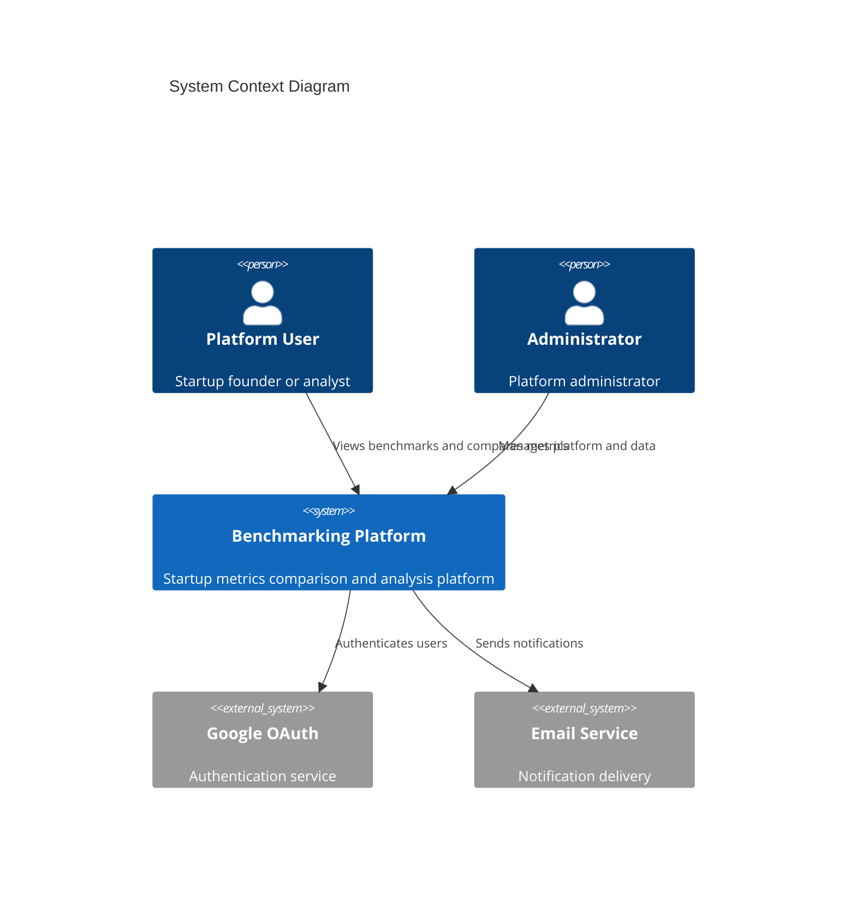

### 2.1.2 Container Diagram (Level 1)

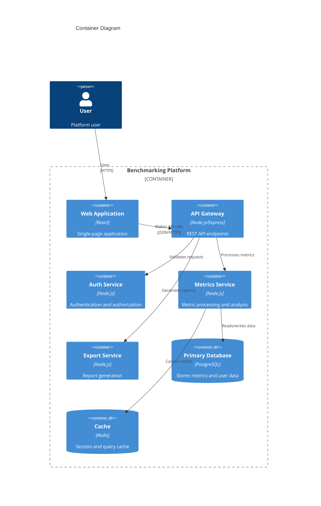

## 2.2 Component Details

### 2.2.1 Component Architecture

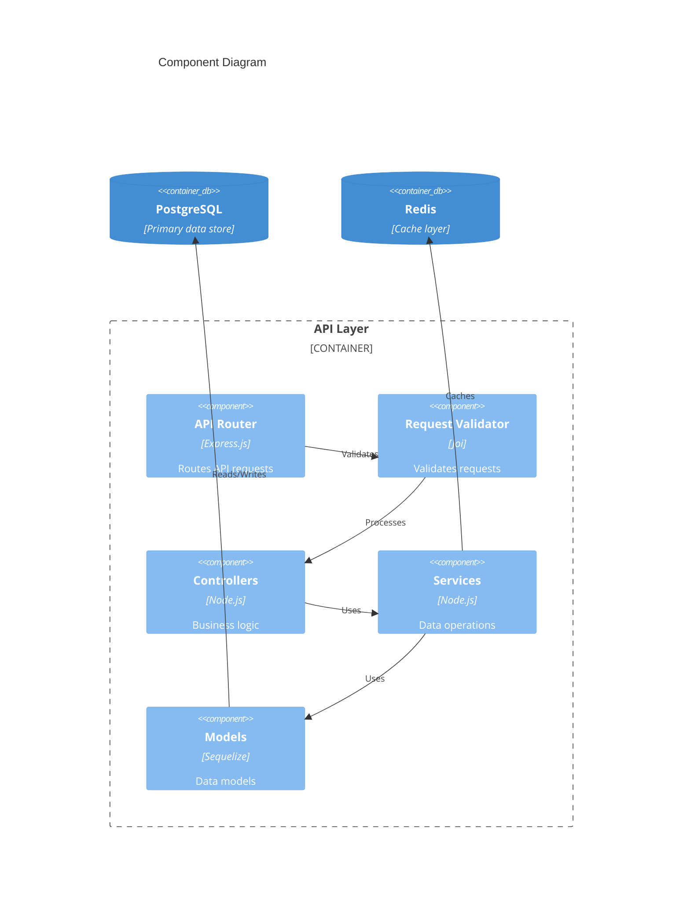

### 2.2.2 Component Specifications

| Component | Technology | Purpose | Scaling Strategy |
|-----------|------------|---------|------------------|
| Web Frontend | React | User interface | Horizontal scaling, CDN |
| API Gateway | Express.js | Request routing | Load balancing |
| Auth Service | Node.js/Passport | Authentication | Session replication |
| Metrics Service | Node.js | Data processing | Worker pools |
| Export Service | Node.js/PDFKit | Report generation | Queue-based processing |
| Database | PostgreSQL 13+ | Data persistence | Read replicas |
| Cache | Redis 6+ | Performance optimization | Cluster mode |

## 2.3 Technical Decisions

### 2.3.1 Data Flow Architecture

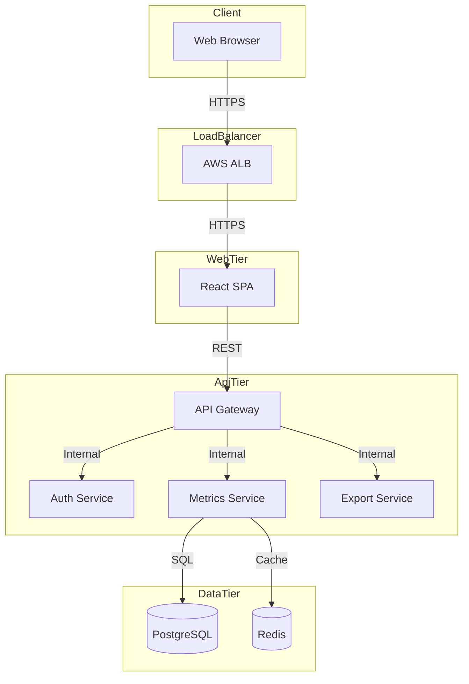

### 2.3.2 Architecture Decisions

| Decision | Choice | Rationale |
|----------|--------|-----------|
| Architecture Style | Modular Monolith | Simplifies deployment while maintaining separation of concerns |
| API Design | REST | Industry standard, excellent tooling support |
| Data Storage | PostgreSQL | ACID compliance, JSON support, scalability |
| Caching | Redis | High performance, distributed caching capabilities |
| Authentication | JWT + Sessions | Balance between security and performance |

## 2.4 Cross-Cutting Concerns

### 2.4.1 Monitoring Architecture

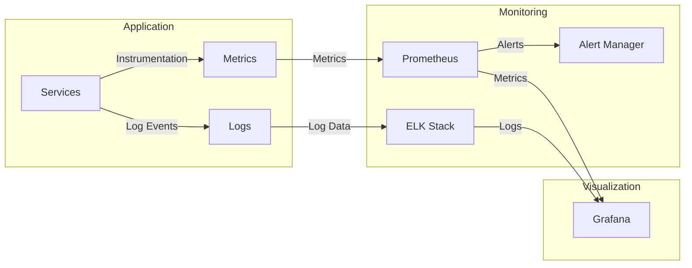

### 2.4.2 Deployment Architecture

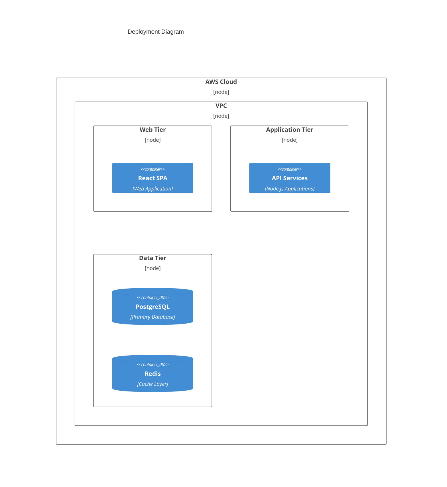

## 2.5 Infrastructure Requirements

| Component | Specification | Scaling Limits |
|-----------|--------------|----------------|
| Web Servers | t3.medium (min 2) | Auto-scale to 10 |
| API Servers | t3.large (min 2) | Auto-scale to 8 |
| Database | db.r5.xlarge | Read replicas: 3 |
| Cache | cache.r5.large | Cluster mode enabled |
| Load Balancer | Application LB | Multi-AZ |
| Storage | gp3 SSD | Auto-scaling enabled |

# 3. SYSTEM COMPONENTS ARCHITECTURE

## 3.1 USER INTERFACE DESIGN

### 3.1.1 Design System Specifications

| Component | Specification | Implementation Details |
|-----------|--------------|----------------------|
| Typography | Primary: Inter | - Headings: 16-32px<br>- Body: 14-16px<br>- Labels: 12px |
| Color Palette | Brand Colors | - Primary: #151e2d<br>- Secondary: #46608C<br>- Accent: #168947<br>- Background: #DBEAAC<br>- Text: #0D3330 |
| Spacing | 8px Base Unit | - Margins: 8px, 16px, 24px, 32px<br>- Padding: 8px, 16px, 24px<br>- Grid: 8px gutters |
| Breakpoints | Responsive | - Mobile: 320px-767px<br>- Tablet: 768px-1023px<br>- Desktop: 1024px+ |

### 3.1.2 Component Library

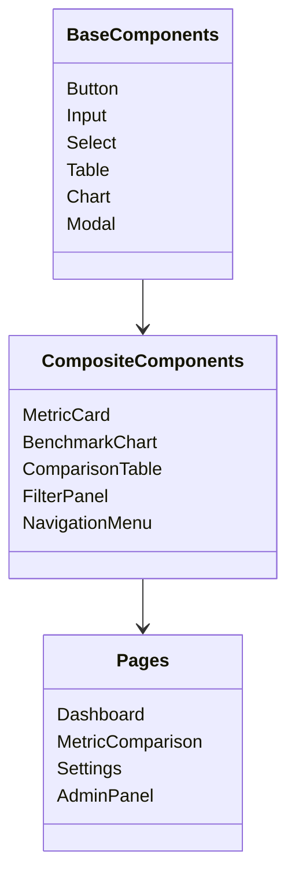

### 3.1.3 Critical User Flows

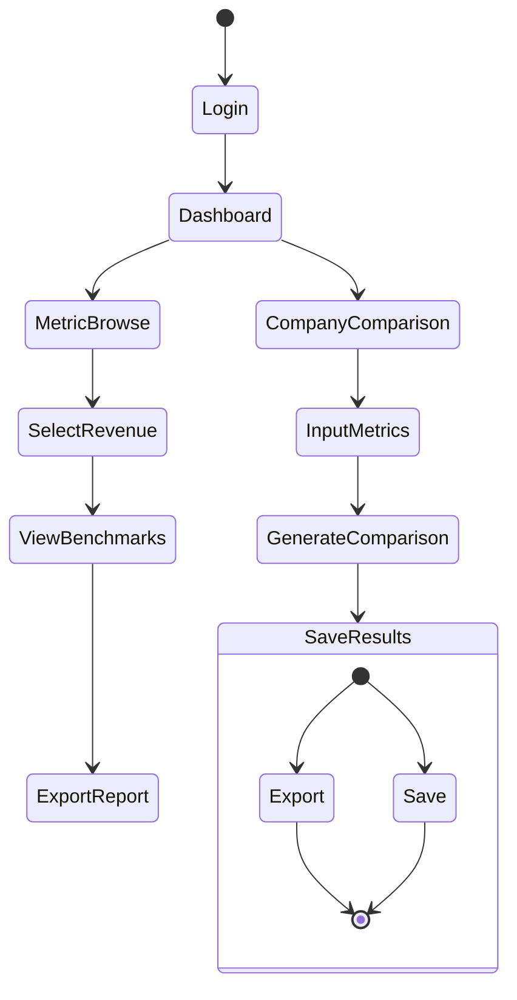

## 3.2 DATABASE DESIGN

### 3.2.1 Schema Design

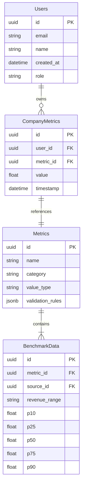

### 3.2.2 Indexing Strategy

| Table | Index Type | Columns | Purpose |
|-------|------------|---------|---------|
| Users | B-tree | email | Login lookups |
| CompanyMetrics | B-tree | (user_id, metric_id) | Metric queries |
| Metrics | B-tree | category | Category filtering |
| BenchmarkData | B-tree | (metric_id, revenue_range) | Benchmark lookups |

### 3.2.3 Partitioning Strategy

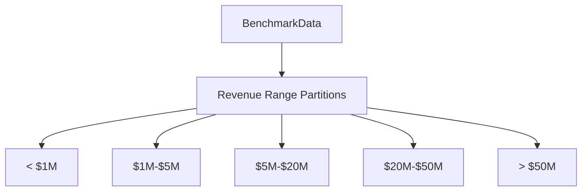

## 3.3 API DESIGN

### 3.3.1 API Architecture

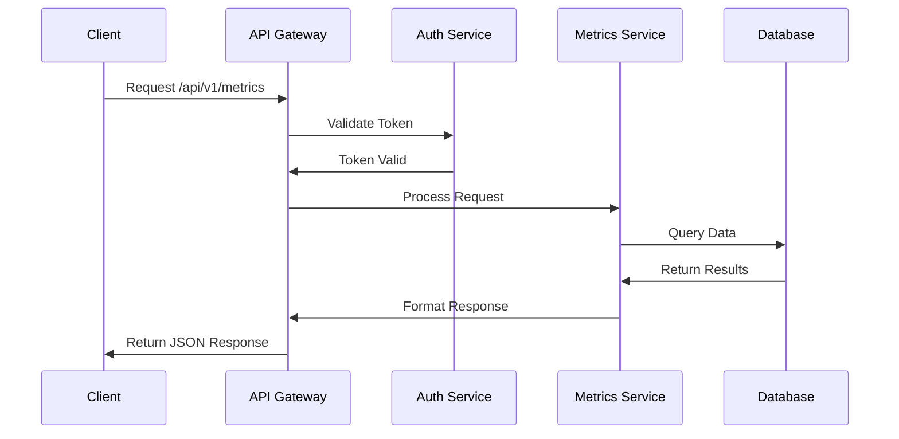

### 3.3.2 Endpoint Specifications

| Endpoint | Method | Purpose | Auth Required |
|----------|--------|---------|---------------|
| /api/v1/metrics | GET | List available metrics | Yes |
| /api/v1/metrics/{id}/benchmarks | GET | Get benchmark data | Yes |
| /api/v1/company/metrics | POST | Save company metrics | Yes |
| /api/v1/reports | POST | Generate comparison report | Yes |

### 3.3.3 Authentication Flow

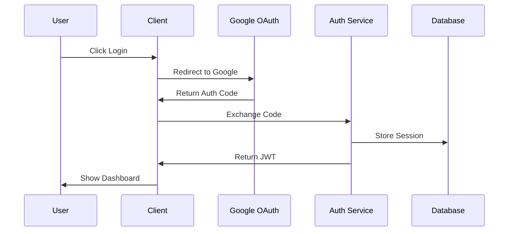

### 3.3.4 Rate Limiting

| Tier | Rate Limit | Burst Limit |
|------|------------|-------------|
| Free | 100/hour | 10/minute |
| Pro | 1000/hour | 50/minute |
| Enterprise | 10000/hour | 200/minute |

### 3.3.5 Error Handling

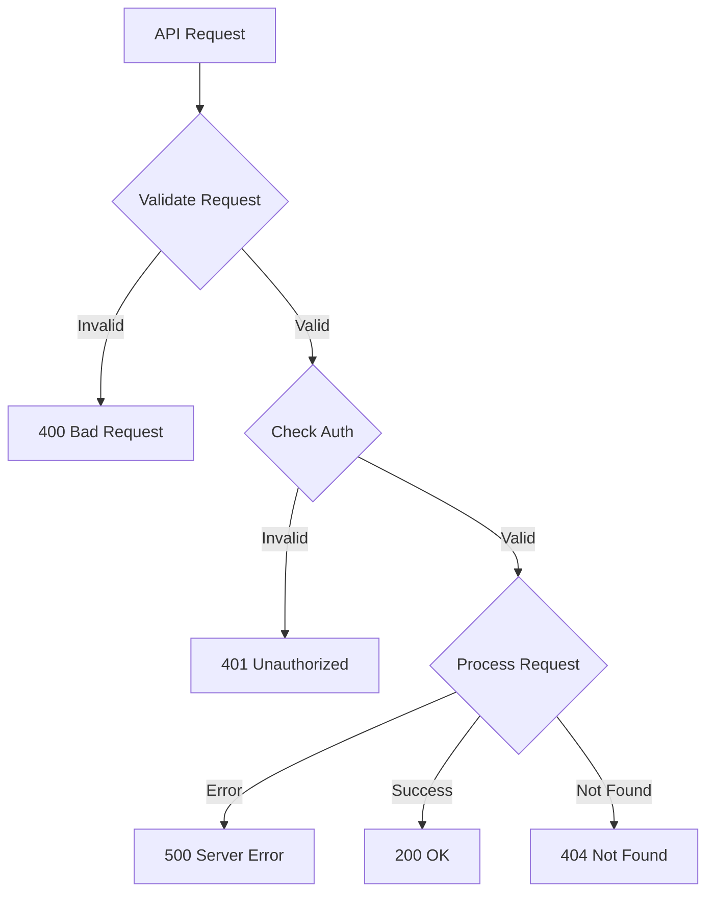

### 3.3.6 Response Format

```json
{
  "status": "success",
  "data": {
    "metric": {
      "id": "uuid",
      "name": "string",
      "value": "number",
      "benchmarks": {
        "p10": "number",
        "p50": "number",
        "p90": "number"
      }
    }
  },
  "metadata": {
    "timestamp": "datetime",
    "version": "string"
  }
}
```

# 4. TECHNOLOGY STACK

## 4.1 PROGRAMMING LANGUAGES

| Layer | Language | Version | Justification |
|-------|----------|---------|---------------|
| Frontend | TypeScript | 4.9+ | - Strong typing for complex metric calculations<br>- Enhanced IDE support<br>- Better maintainability for large codebase |
| Backend | Node.js | 18 LTS | - JavaScript ecosystem consistency<br>- Excellent async performance for API calls<br>- Rich package ecosystem for metrics processing |
| Database | SQL | PostgreSQL 13+ | - ACID compliance requirement<br>- Complex metric relationships<br>- JSON support for flexible data structures |

## 4.2 FRAMEWORKS & LIBRARIES

### 4.2.1 Core Frameworks

| Component | Framework | Version | Purpose |
|-----------|-----------|---------|----------|
| Frontend | React | 18.2+ | - Component-based architecture<br>- Virtual DOM for chart updates<br>- Extensive visualization libraries |
| API Layer | Express.js | 4.18+ | - RESTful API implementation<br>- Middleware support<br>- Request validation |
| ORM | Sequelize | 6.31+ | - PostgreSQL integration<br>- Migration support<br>- Transaction management |

### 4.2.2 Supporting Libraries

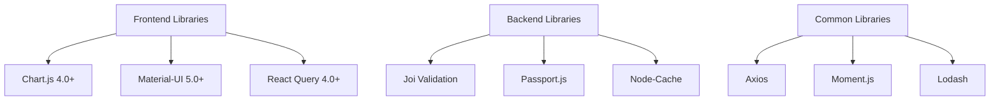

## 4.3 DATABASES & STORAGE

### 4.3.1 Database Architecture

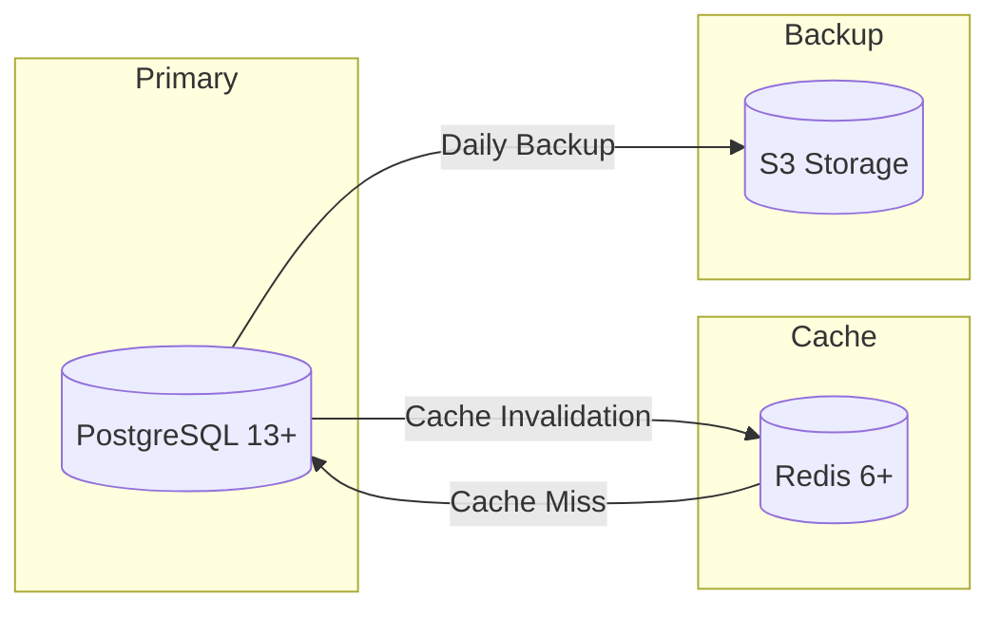

### 4.3.2 Storage Solutions

| Type | Technology | Purpose |
|------|------------|---------|
| Primary Database | PostgreSQL 13+ | Metric data, user profiles, benchmark data |
| Cache Layer | Redis 6+ | Session storage, query results, rate limiting |
| Object Storage | AWS S3 | Report exports, backup storage |
| In-Memory Store | Node-Cache | Application-level caching |

## 4.4 THIRD-PARTY SERVICES

### 4.4.1 Service Integration Architecture

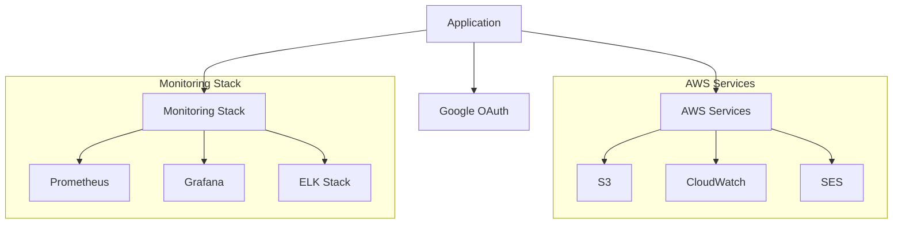

### 4.4.2 External Services

| Service | Provider | Purpose |
|---------|----------|---------|
| Authentication | Google OAuth 2.0 | User authentication |
| Email | AWS SES | System notifications |
| Monitoring | Prometheus/Grafana | System metrics |
| Logging | ELK Stack | Log aggregation |
| Storage | AWS S3 | File storage |

## 4.5 DEVELOPMENT & DEPLOYMENT

### 4.5.1 Development Pipeline

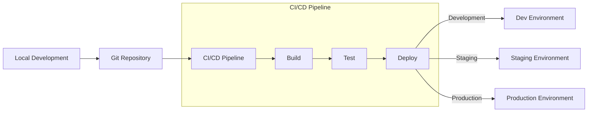

### 4.5.2 Development Tools

| Category | Tool | Purpose |
|----------|------|---------|
| IDE | VS Code | Development environment |
| Version Control | Git | Source code management |
| Container Runtime | Docker | Application containerization |
| CI/CD | Jenkins | Automated deployment |
| Testing | Jest/Supertest | Unit/Integration testing |
| Documentation | Swagger/OpenAPI | API documentation |

### 4.5.3 Environment Requirements

| Environment | Specifications | Purpose |
|-------------|---------------|----------|
| Development | - Node.js 18 LTS<br>- PostgreSQL 13+<br>- Redis 6+<br>- Docker 20+ | Local development |
| Staging | - AWS t3.medium<br>- RDS db.t3.medium<br>- ElastiCache cache.t3.medium | Testing |
| Production | - AWS t3.large<br>- RDS db.r5.large<br>- ElastiCache cache.r5.large | Live deployment |

# 5. SYSTEM DESIGN

## 5.1 USER INTERFACE DESIGN

### 5.1.1 Layout Structure

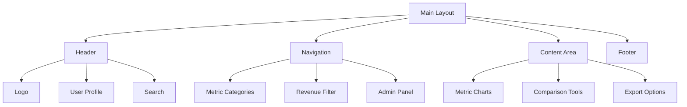

### 5.1.2 Component Specifications

| Component | Description | Behavior |
|-----------|-------------|-----------|
| Header | Fixed top bar with brand colors | - Sticky positioning<br>- Responsive collapse<br>- User menu dropdown |
| Navigation | Left-side expandable menu | - Collapsible categories<br>- Active state indicators<br>- Smooth transitions |
| Content Area | Dynamic main content region | - Responsive grid layout<br>- Chart containers<br>- Form elements |
| Metric Charts | Interactive data visualizations | - Hover tooltips<br>- Click interactions<br>- Export options |

### 5.1.3 Responsive Behavior

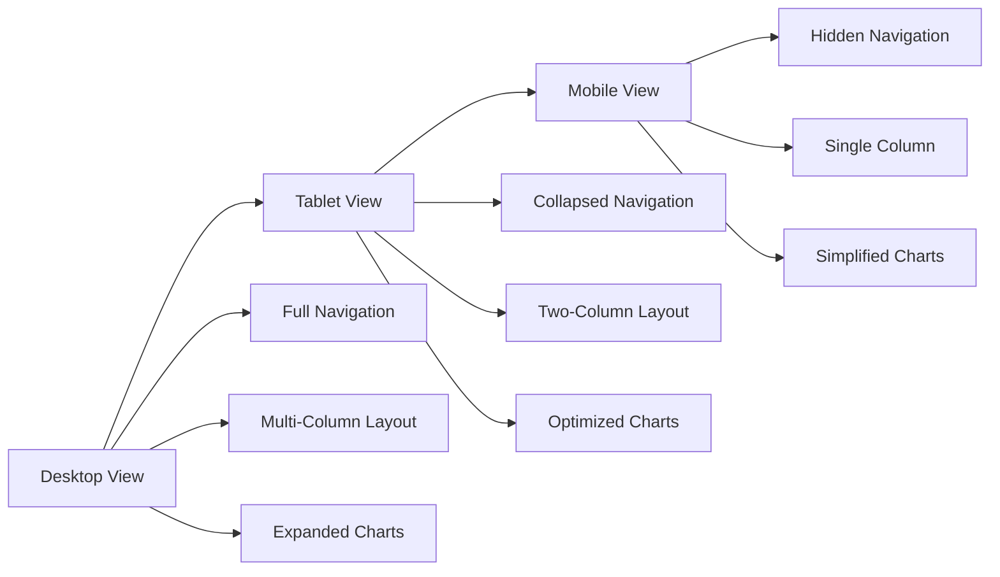

## 5.2 DATABASE DESIGN

### 5.2.1 Schema Design

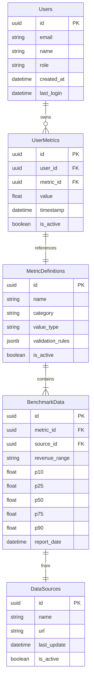

### 5.2.2 Indexing Strategy

| Table | Index Type | Columns | Purpose |
|-------|------------|---------|----------|
| Users | B-tree | email | Login lookups |
| UserMetrics | B-tree | (user_id, metric_id) | Metric queries |
| MetricDefinitions | B-tree | category | Category filtering |
| BenchmarkData | B-tree | (metric_id, revenue_range) | Benchmark lookups |
| DataSources | B-tree | name | Source filtering |

## 5.3 API DESIGN

### 5.3.1 API Architecture

```mermaid
sequenceDiagram
    participant Client
    participant Gateway
    participant Auth
    participant MetricsService
    participant Database
    
    Client->>Gateway: Request /api/v1/metrics
    Gateway->>Auth: Validate Token
    Auth->>Gateway: Token Valid
    Gateway->>MetricsService: Process Request
    MetricsService->>Database: Query Data
    Database->>MetricsService: Return Results
    MetricsService->>Gateway: Format Response
    Gateway->>Client: Return JSON
```

### 5.3.2 API Endpoints

| Endpoint | Method | Description | Auth Required |
|----------|--------|-------------|---------------|
| /api/v1/metrics | GET | List available metrics | Yes |
| /api/v1/metrics/{id}/benchmarks | GET | Get benchmark data | Yes |
| /api/v1/company/metrics | POST | Save company metrics | Yes |
| /api/v1/reports | POST | Generate comparison report | Yes |

### 5.3.3 Response Format

```json
{
  "status": "success",
  "data": {
    "metric": {
      "id": "uuid",
      "name": "string",
      "value": "number",
      "benchmarks": {
        "p10": "number",
        "p50": "number",
        "p90": "number"
      }
    }
  },
  "metadata": {
    "timestamp": "datetime",
    "version": "string"
  }
}
```

### 5.3.4 Error Handling

```mermaid
flowchart TD
    A[API Request] --> B{Validate Request}
    B -->|Invalid| C[400 Bad Request]
    B -->|Valid| D{Check Auth}
    D -->|Invalid| E[401 Unauthorized]
    D -->|Valid| F{Process Request}
    F -->|Error| G[500 Server Error]
    F -->|Success| H[200 OK]
    F -->|Not Found| I[404 Not Found]
```

### 5.3.5 Rate Limiting

| Tier | Rate Limit | Burst Limit |
|------|------------|-------------|
| Free | 100/hour | 10/minute |
| Pro | 1000/hour | 50/minute |
| Enterprise | 10000/hour | 200/minute |

### 5.3.6 Authentication Flow

```mermaid
sequenceDiagram
    participant User
    participant Client
    participant Google
    participant Auth
    participant DB
    
    User->>Client: Click Login
    Client->>Google: Redirect to OAuth
    Google->>Client: Return Auth Code
    Client->>Auth: Exchange Code
    Auth->>DB: Store Session
    Auth->>Client: Return JWT
    Client->>User: Show Dashboard
```

# 6. USER INTERFACE DESIGN

## 6.1 Layout Components

### 6.1.1 Main Navigation Layout
```
+------------------------------------------+
|  [#] Brand Logo    [@] Profile    [=]    |
+------------------------------------------+
|  +----------+  +----------------------+   |
|  | Nav Menu |  |    Content Area     |   |
|  | +--ARR   |  |                     |   |
|  | +--NDR   |  |                     |   |
|  | +--CAC   |  |                     |   |
|  | +--G&A   |  |                     |   |
|  +----------+  |                     |   |
|               |                     |   |
+------------------------------------------+
```

### 6.1.2 Metric Selection Interface
```
+------------------------------------------+
| Revenue Range [v $1M-$5M]    [?]         |
+------------------------------------------+
| Select Metric Category:                   |
| ( ) Financial                            |
| (•) Growth                               |
| ( ) Operational                          |
+------------------------------------------+
| Available Metrics:                        |
| [•] ARR Growth                           |
| [ ] NDR                                  |
| [ ] Logo Retention                       |
+------------------------------------------+
| [Compare Metrics]    [Reset Selection]    |
+------------------------------------------+
```

### 6.1.3 Benchmark Comparison View
```
+------------------------------------------+
| ARR Growth Rate Comparison    [^] Export  |
+------------------------------------------+
| Your Company: [...75.5%]     [!] Above P90|
+------------------------------------------+
| Industry Benchmarks:                      |
| P90 [$] |============================| 70%|
| P75 [$] |====================|       | 50%|
| P50 [$] |===============|            | 35%|
| P25 [$] |=========|                  | 20%|
| P10 [$] |====|                       | 10%|
+------------------------------------------+
| Data Sources: [v Show All]               |
| [*] Source A                             |
| [*] Source B                             |
+------------------------------------------+
```

### 6.1.4 Data Input Form
```
+------------------------------------------+
| Enter Company Metrics            [?]      |
+------------------------------------------+
| Annual Recurring Revenue:                 |
| [$] [...................] [i] USD        |
|                                          |
| Growth Rate:                             |
| [%] [...................] [i] YoY        |
|                                          |
| Customer Count:                          |
| [#] [...................] [i] Active     |
+------------------------------------------+
| [Save Metrics]  [Clear Form]  [< Back]   |
+------------------------------------------+
```

## 6.2 Component Key

### Navigation Elements
- [#] - Dashboard/Menu icon
- [@] - User profile access
- [=] - Settings menu
- [<] [>] - Navigation controls
- [^] - Export functionality

### Input Controls
- [...] - Text input field
- [ ] - Checkbox
- (•) - Selected radio button
- ( ) - Unselected radio button
- [v] - Dropdown menu

### Indicators
- [$] - Financial metric
- [%] - Percentage value
- [#] - Numeric value
- [!] - Alert/Warning
- [?] - Help tooltip
- [i] - Information
- [*] - Selected/Important

### Progress Elements
- |====| - Progress/benchmark bar
- P90, P75, etc. - Percentile indicators

## 6.3 Interaction Specifications

### 6.3.1 Navigation Behavior
- Left menu expands/collapses on hover
- Category selection highlights active item
- Breadcrumb trail shows current location
- Back button returns to previous view

### 6.3.2 Data Entry Rules
- Financial inputs auto-format with commas
- Percentage inputs limited to 0-100
- Real-time validation with error messages
- Tab order follows logical form flow

### 6.3.3 Chart Interactions
- Hover reveals detailed metrics
- Click source toggles visibility
- Double-click expands to full view
- Drag to select range for zoom

### 6.3.4 Responsive Adjustments
- Menu collapses to icon bar on tablet
- Single column layout on mobile
- Charts scale to viewport width
- Touch-friendly tap targets

## 6.4 Brand Implementation

### 6.4.1 Color Application
- Primary Navigation: #151e2d
- Secondary Elements: #46608C
- Accent Elements: #168947
- Background: #DBEAAC
- Text: #0D3330

### 6.4.2 Typography
- Headers: Inter Bold
- Body Text: Inter Regular
- Metrics: Inter Mono
- Minimum Size: 12px
- Maximum Size: 32px

## 6.5 Accessibility Features

### 6.5.1 Keyboard Navigation
- Full tab index implementation
- Visible focus indicators
- Keyboard shortcuts for common actions
- Skip navigation link

### 6.5.2 Screen Reader Support
- ARIA labels on all interactive elements
- Semantic HTML structure
- Alternative text for charts/graphs
- Announcement of dynamic content updates

# 7. SECURITY CONSIDERATIONS

## 7.1 AUTHENTICATION AND AUTHORIZATION

### 7.1.1 Authentication Flow

```mermaid
sequenceDiagram
    participant User
    participant Frontend
    participant AuthService
    participant GoogleOAuth
    participant Database

    User->>Frontend: Access Platform
    Frontend->>AuthService: Check Session
    AuthService->>Frontend: No Valid Session
    Frontend->>GoogleOAuth: Redirect to OAuth
    GoogleOAuth->>Frontend: Return Auth Code
    Frontend->>AuthService: Exchange Code
    AuthService->>Database: Validate/Create User
    Database->>AuthService: User Details
    AuthService->>Frontend: JWT Token
    Frontend->>User: Access Granted
```

### 7.1.2 Authorization Matrix

| Role | Metrics View | Company Data | Benchmark Data | Admin Panel | User Management |
|------|-------------|--------------|----------------|-------------|-----------------|
| User | Read | Create/Read/Update | Read | No Access | No Access |
| Analyst | Read | Read | Read | No Access | No Access |
| Admin | Read | Read | Create/Read/Update | Full Access | Full Access |
| System | Full | Full | Full | Full | Full |

### 7.1.3 Session Management

| Component | Implementation | Details |
|-----------|---------------|----------|
| Token Type | JWT | RS256 signing algorithm |
| Token Lifetime | 1 hour | Sliding expiration |
| Refresh Token | 14 days | Secure HTTP-only cookie |
| Session Store | Redis | Cluster-enabled with replication |
| Invalidation | Immediate | On logout or security breach |

## 7.2 DATA SECURITY

### 7.2.1 Encryption Standards

| Data State | Method | Key Management |
|------------|--------|----------------|
| At Rest | AES-256-GCM | AWS KMS rotation every 90 days |
| In Transit | TLS 1.3 | Auto-renewed certificates |
| In Memory | Secure heap allocation | Memory wiping after use |
| Backups | AES-256-CBC | Separate backup encryption keys |

### 7.2.2 Data Classification

```mermaid
graph TD
    A[Data Classification] --> B[Public]
    A --> C[Internal]
    A --> D[Confidential]
    A --> E[Restricted]

    B --> F[Benchmark Aggregates]
    C --> G[User Profiles]
    D --> H[Company Metrics]
    E --> I[Authentication Data]

    subgraph Security Controls
        F --> J[No Encryption]
        G --> K[Transport Encryption]
        H --> L[Field-Level Encryption]
        I --> M[Full Encryption + Audit]
    end
```

### 7.2.3 Data Access Controls

| Data Type | Access Method | Authentication Required | Encryption | Audit Logging |
|-----------|---------------|------------------------|------------|---------------|
| Benchmark Data | API | Yes | Transport | Basic |
| Company Metrics | API | Yes | Transport + Storage | Detailed |
| User Data | API | Yes | Transport + Storage | Detailed |
| Admin Data | Admin API | Yes + 2FA | Full | Full |

## 7.3 SECURITY PROTOCOLS

### 7.3.1 Security Headers

| Header | Value | Purpose |
|--------|--------|---------|
| Strict-Transport-Security | max-age=31536000; includeSubDomains | Force HTTPS |
| Content-Security-Policy | default-src 'self' | Prevent XSS |
| X-Frame-Options | DENY | Prevent clickjacking |
| X-Content-Type-Options | nosniff | Prevent MIME sniffing |
| X-XSS-Protection | 1; mode=block | Additional XSS protection |

### 7.3.2 Security Monitoring

```mermaid
flowchart TD
    A[Security Events] --> B{Event Router}
    B --> C[Access Logs]
    B --> D[Error Logs]
    B --> E[Audit Logs]
    
    C --> F[ELK Stack]
    D --> F
    E --> F
    
    F --> G[Alert Manager]
    G --> H[Security Team]
    G --> I[Automated Response]
    
    I --> J[IP Blocking]
    I --> K[Account Lockout]
    I --> L[Admin Notification]
```

### 7.3.3 Security Compliance

| Standard | Implementation | Verification |
|----------|---------------|--------------|
| GDPR | Data minimization, consent management | Annual audit |
| CCPA | Privacy controls, data deletion | Quarterly review |
| SOC 2 | Access controls, encryption | External audit |
| ISO 27001 | Security management framework | Annual certification |

### 7.3.4 Incident Response

```mermaid
stateDiagram-v2
    [*] --> Detection
    Detection --> Analysis
    Analysis --> Containment
    Containment --> Eradication
    Eradication --> Recovery
    Recovery --> PostIncident
    PostIncident --> [*]

    state Analysis {
        [*] --> Triage
        Triage --> Impact
        Impact --> [*]
    }

    state Containment {
        [*] --> IsolateSystem
        IsolateSystem --> SecureEvidence
        SecureEvidence --> [*]
    }
```

### 7.3.5 Security Testing

| Test Type | Frequency | Tools | Scope |
|-----------|-----------|-------|-------|
| Penetration Testing | Quarterly | Burp Suite, OWASP ZAP | External interfaces |
| Vulnerability Scanning | Weekly | Nessus, OpenVAS | All systems |
| Code Security Analysis | On commit | SonarQube, Snyk | All code |
| Dependency Audit | Daily | npm audit, OWASP Dependency-Check | All dependencies |

# 8. INFRASTRUCTURE

## 8.1 DEPLOYMENT ENVIRONMENT

The Startup Metrics Benchmarking Platform utilizes a cloud-native architecture deployed exclusively on AWS infrastructure.

### 8.1.1 Environment Architecture

```mermaid
flowchart TD
    subgraph Production
        A[AWS Production Account]
        subgraph VPC-Prod
            B[Public Subnets]
            C[Private Subnets]
            D[Database Subnets]
        end
    end
    
    subgraph Staging
        E[AWS Staging Account]
        subgraph VPC-Stage
            F[Public Subnets]
            G[Private Subnets]
            H[Database Subnets]
        end
    end
    
    subgraph Development
        I[AWS Development Account]
        subgraph VPC-Dev
            J[Public Subnets]
            K[Private Subnets]
            L[Database Subnets]
        end
    end
```

### 8.1.2 Environment Specifications

| Environment | Purpose | Infrastructure Specifications |
|-------------|---------|----------------------------|
| Production | Live system | - Multi-AZ deployment<br>- Auto-scaling enabled<br>- High availability configuration<br>- Full monitoring and alerting |
| Staging | Pre-production testing | - Single-AZ deployment<br>- Limited auto-scaling<br>- Monitoring enabled<br>- Production-like configuration |
| Development | Development and testing | - Single-AZ deployment<br>- Minimal resources<br>- Basic monitoring<br>- Development tools enabled |

## 8.2 CLOUD SERVICES

### 8.2.1 AWS Service Configuration

| Service | Purpose | Configuration |
|---------|---------|---------------|
| ECS Fargate | Container hosting | - Task definitions for each service<br>- Auto-scaling policies<br>- Service discovery enabled |
| RDS PostgreSQL | Primary database | - Multi-AZ for production<br>- Automated backups<br>- Performance insights enabled |
| ElastiCache Redis | Caching layer | - Cluster mode enabled<br>- Multi-AZ for production<br>- Automatic failover |
| S3 | Static assets & backups | - Versioning enabled<br>- Lifecycle policies<br>- Cross-region replication |
| CloudFront | CDN | - Custom domain configuration<br>- SSL/TLS certification<br>- Edge location optimization |

### 8.2.2 Network Architecture

```mermaid
flowchart TD
    A[CloudFront] --> B[ALB]
    B --> C[ECS Fargate Tasks]
    C --> D[RDS PostgreSQL]
    C --> E[ElastiCache Redis]
    C --> F[S3 Bucket]
    
    subgraph VPC
        B
        C
        D
        E
    end
    
    subgraph Security
        G[WAF]
        H[Shield]
        I[GuardDuty]
    end
    
    G --> A
    H --> A
    I --> VPC
```

## 8.3 CONTAINERIZATION

### 8.3.1 Docker Configuration

```mermaid
graph TD
    subgraph Docker Images
        A[Base Node.js Image]
        B[Frontend Image]
        C[API Image]
        D[Worker Image]
        
        A --> B
        A --> C
        A --> D
    end
    
    subgraph Container Registry
        E[ECR Repository]
    end
    
    B --> E
    C --> E
    D --> E
```

### 8.3.2 Container Specifications

| Service | Base Image | Resources | Scaling Limits |
|---------|------------|-----------|----------------|
| Frontend | node:18-alpine | 1 CPU, 2GB RAM | 1-10 containers |
| API | node:18-alpine | 2 CPU, 4GB RAM | 2-20 containers |
| Worker | node:18-alpine | 2 CPU, 4GB RAM | 1-5 containers |

## 8.4 ORCHESTRATION

### 8.4.1 ECS Task Definitions

```mermaid
graph TD
    subgraph ECS Cluster
        A[Service Discovery]
        B[Task Definitions]
        C[Auto Scaling]
        
        subgraph Services
            D[Frontend Service]
            E[API Service]
            F[Worker Service]
        end
        
        B --> D
        B --> E
        B --> F
        
        A --> Services
        C --> Services
    end
```

### 8.4.2 Service Configuration

| Service | Task Definition | Auto-Scaling Rules | Health Checks |
|---------|----------------|-------------------|---------------|
| Frontend | - 1 CPU unit<br>- 2GB memory<br>- 80 port exposed | CPU > 70%<br>Memory > 80% | HTTP 200 on /health |
| API | - 2 CPU units<br>- 4GB memory<br>- 3000 port exposed | Request count > 1000/min<br>CPU > 70% | HTTP 200 on /api/health |
| Worker | - 2 CPU units<br>- 4GB memory<br>- No exposed ports | Queue length > 1000<br>CPU > 80% | Process health check |

## 8.5 CI/CD PIPELINE

### 8.5.1 Pipeline Architecture

```mermaid
flowchart LR
    A[GitHub Repository] --> B[GitHub Actions]
    B --> C{Tests Pass?}
    C -->|Yes| D[Build Images]
    C -->|No| E[Notify Team]
    D --> F[Push to ECR]
    F --> G{Environment?}
    G -->|Dev| H[Deploy to Dev]
    G -->|Staging| I[Deploy to Staging]
    G -->|Prod| J[Manual Approval]
    J --> K[Deploy to Prod]
```

### 8.5.2 Pipeline Stages

| Stage | Actions | Success Criteria |
|-------|---------|-----------------|
| Build | - Code checkout<br>- Dependencies installation<br>- Code linting<br>- Unit tests | All tests pass |
| Test | - Integration tests<br>- Security scans<br>- Code coverage | >80% coverage<br>No critical vulnerabilities |
| Package | - Docker image builds<br>- Image scanning<br>- Tag and push to ECR | Images built and scanned |
| Deploy | - ECS task update<br>- Health check verification<br>- Rollback capability | Services healthy |
| Monitor | - Performance metrics<br>- Error tracking<br>- User impact | No critical alerts |

### 8.5.3 Deployment Strategy

| Environment | Strategy | Rollback Time | Validation |
|-------------|----------|---------------|------------|
| Development | Direct deployment | Immediate | Basic health checks |
| Staging | Blue/Green | < 5 minutes | Full test suite |
| Production | Blue/Green | < 2 minutes | Progressive traffic shift |

# APPENDICES

## A. ADDITIONAL TECHNICAL INFORMATION

### A.1 Caching Strategy

```mermaid
flowchart TD
    A[Request] --> B{Cache Check}
    B -->|Hit| C[Return Cached Data]
    B -->|Miss| D[Query Database]
    D --> E[Process Data]
    E --> F[Cache Result]
    F --> G[Return Response]
    C --> G
```

| Cache Level | Implementation | TTL | Purpose |
|------------|----------------|-----|---------|
| Browser | Local Storage | 1 hour | UI preferences, filters |
| API | Redis | 15 minutes | API responses, session data |
| Database | PostgreSQL | 1 day | Aggregate metrics, reports |
| CDN | CloudFront | 1 hour | Static assets, images |

### A.2 Error Handling Matrix

| Error Type | HTTP Code | Retry Strategy | User Message |
|------------|-----------|----------------|--------------|
| Authentication | 401 | None | "Please log in again" |
| Authorization | 403 | None | "Insufficient permissions" |
| Rate Limit | 429 | Exponential backoff | "Please try again later" |
| Validation | 400 | None | Specific field errors |
| Server Error | 500 | 3 attempts | "Service temporarily unavailable" |

## B. GLOSSARY

| Term | Definition |
|------|------------|
| Annual Recurring Revenue (ARR) | The yearly value of subscription-based revenue |
| Benchmark Data | Industry standard metrics used for comparison |
| Customer Acquisition Cost (CAC) | Total cost to acquire a new customer |
| Gross Margin | Revenue minus cost of goods sold |
| Magic Number | Sales efficiency metric (Net New ARR / S&M Spend) |
| Net Dollar Retention (NDR) | Revenue retention including expansions/contractions |
| Pipeline Coverage | Ratio of opportunities to revenue target |
| Revenue Range | ARR bracket for benchmark comparison |

## C. ACRONYMS

| Acronym | Full Form |
|---------|-----------|
| API | Application Programming Interface |
| ARR | Annual Recurring Revenue |
| AWS | Amazon Web Services |
| CAC | Customer Acquisition Cost |
| CCPA | California Consumer Privacy Act |
| CDN | Content Delivery Network |
| CI/CD | Continuous Integration/Continuous Deployment |
| CPU | Central Processing Unit |
| CSV | Comma-Separated Values |
| DB | Database |
| GDPR | General Data Protection Regulation |
| G&A | General and Administrative |
| HTTP | Hypertext Transfer Protocol |
| HTTPS | HTTP Secure |
| IDE | Integrated Development Environment |
| IP | Internet Protocol |
| JSON | JavaScript Object Notation |
| JWT | JSON Web Token |
| NDR | Net Dollar Retention |
| OAuth | Open Authorization |
| PDF | Portable Document Format |
| RAM | Random Access Memory |
| RBAC | Role-Based Access Control |
| REST | Representational State Transfer |
| S&M | Sales and Marketing |
| SaaS | Software as a Service |
| SDK | Software Development Kit |
| SLA | Service Level Agreement |
| SQL | Structured Query Language |
| SSL | Secure Sockets Layer |
| TLS | Transport Layer Security |
| TTL | Time To Live |
| UI | User Interface |
| URL | Uniform Resource Locator |
| UUID | Universally Unique Identifier |
| VPC | Virtual Private Cloud |
| WCAG | Web Content Accessibility Guidelines |
| XSS | Cross-Site Scripting |
| YoY | Year over Year |

## D. REVISION HISTORY

| Version | Date | Author | Changes |
|---------|------|--------|---------|
| 1.0.0 | Initial | Technical Team | Base document creation |
| 1.1.0 | +1 week | Security Team | Added security specifications |
| 1.2.0 | +2 weeks | Database Team | Enhanced data model details |
| 1.3.0 | +3 weeks | UI Team | Added interface specifications |
| 1.4.0 | +4 weeks | DevOps Team | Infrastructure requirements |

## E. RELATED DOCUMENTS

| Document | Purpose | Location |
|----------|---------|----------|
| API Documentation | Endpoint specifications | /docs/api |
| Database Schema | Data model details | /docs/schema |
| UI Style Guide | Interface standards | /docs/ui |
| Security Policy | Security protocols | /docs/security |
| Deployment Guide | Infrastructure setup | /docs/deploy |